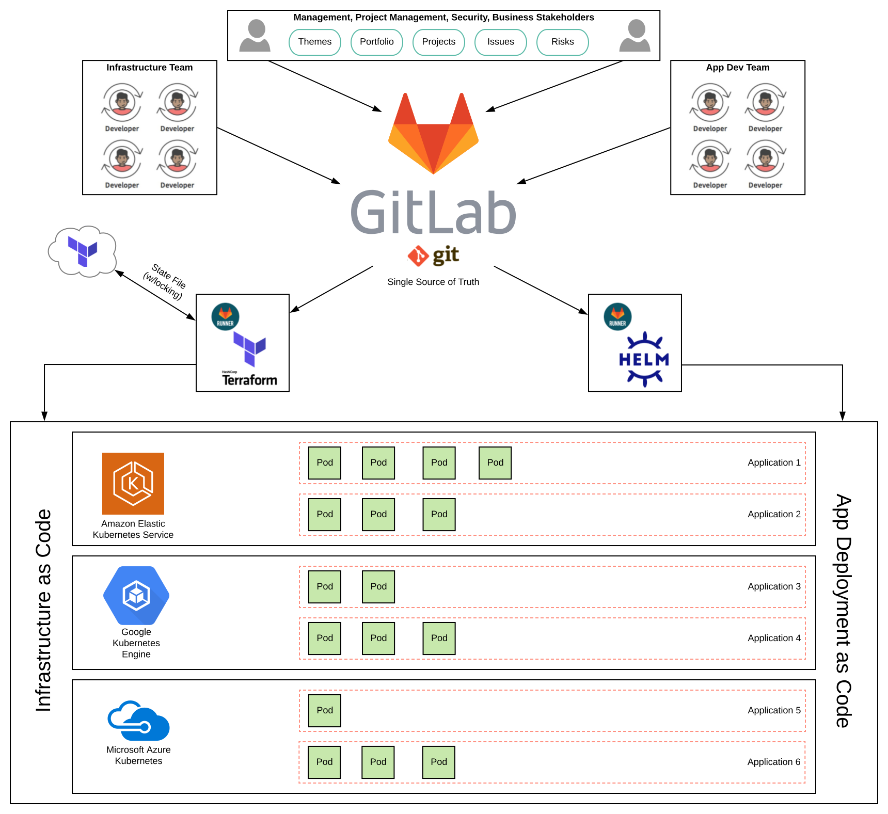
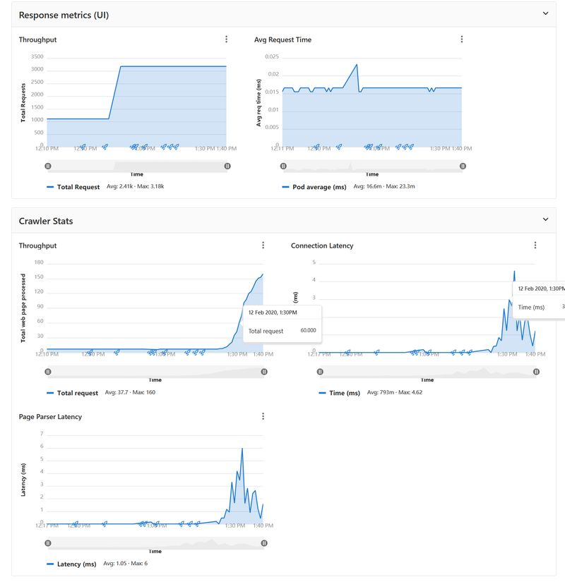

# OTUS-OPS project

## Проектная работа по курсу "DevOps практики и инструменты" от OTUS.ru

### Цели проекта

1. Автоматизация процессов CI/CD и управление платформами:
   - Ресурсы GCP, AWS, Azure
   - Инфраструктура для CI/CD
   - Инфраструктура для сбора обратной связи
   
2. Использовать практику IaC (Infrastructure as Code) для управления конфигурацией и
инфраструктурой
3. Настроить процесс CI/CD
4. Настроить процесс обратной связи
   - Мониторинг (сбор метрик, алертинг, визуализация)
   - Логирование
   - Трейсинг
5. Задокументировать проект
   - README
   - Описание приложения и его архитектуру
   - How to start?
   - CHANGELOG c описанием выполненной работы

### Как добились целей
1. terraform code как основа для развертывания инфраструктуры.
2. gitlab как основа контроля версия и платформа для CI/CD.
3. k8s кластеры разворачиваются с помощью terrafrom из gitlab.
4. CI/CD настроен через gitlab
5. Мониторинг(визуализация) и сбор логов настроены через gitlab.

### Визуальное представления проекта


### Структура группы
 + *readme* - документация про *otus-ops* группу и этот файл
 + *apps/** - программы и CI/CD код, для каждой их них
 + *infra/** - терраформ код для развёртывания каждой облачной конфигурации (vpc, security groups и кластерная конфигурация)
 + *gitlab/* - скрипты для развёртывания основного `gitlab` сервера и выбора облачной системы под него
 + *gitlab-manage* - терраформ код для представления `otus-ops` группы в конфигурации `gitlab`

### GITLIB
Создайте организацию (`otus-ops`) и рабочую область (workspace) - gitlab-manage на https://app.terraform.io.

Измените `Workspace Execution` на `Local`, это делается через меню `Settings` для данного рабочего пространства.

По первой, надо установить  сам `gitlib` или воспользоваться существующим. Необходимо прописать переменную 
для вашего доменного имени. Пригодится сейчас и в дальнейшем:
```bash
export MY_DOMAIN_NAME=example.com
```

**GCP**
Для `gcp` скачайте кредентсы для вашего проекта и поставьте
переменную `GOOGLE_APPLICATION_CREDENTIALS`:
```bash
export GOOGLE_APPLICATION_CREDENTIALS=your_credits_file.json
```
и установите переменную вашего проекта в гугле - `project id`:
```bash
export GOGLE_PROJECT_ID=my-project-id
```
*Важное замечание.* По умолчанию регион выполнения скриптов для развёртывания `gitlab`, выбран `europe-west1-b`, но
вы его можете поменять установив свою переменную `GCP_REGION`:
```bash
export GCP_REGION=us-west1-a
```
После можно выполнить скрипт, который развернёт для вас `gitlab`, с помощью `docker-machine`:
```bash
cd gitlab
./gcp-gitlab.sh
```

**AWS**
```bash
cd gitlab
./aws-gitlab.sh
```

**Azure**
```bash
cd gitlab
./aks-gitlab.sh
```

После установки, запускаем  `gitlab-runner` для CI/CD:
```bash
docker run -d --name gitlab-runner --restart always \
 -v /srv/gitlab-runner/config:/etc/gitlab-runner \
 -v /var/run/docker.sock:/var/run/docker/docker.sock \
 gitlab/gitlab-runner:latest
``` 

После запуска `runner`-а, нужно его зарегистрировать:
```bash
docker exec -it gitlab-runner gitlab-runner register --run-untagged --locked=false
```
в приглашениях введите нужные параметры, это ваш url для доступа к `gitlab` и уникальный токен, его можно
увидеть в `Setting -> CI/CD -> Runners`.

*Предпочтительный вариант*. Есть еще хорошая возможность не возиться с запуском `runner`-а, а использовать `kubernets` для этого.

*Установка* `packages` для работы через https и локальный репозиторий для контейнеров. 
Редактируем `gitlab.rb`:
```bash
docker exec -it gitlab_web_1 nano /etc/gitlab/gitlab.rb
```

находим и заменяем:
```
gitlab_rails['packages_enabled'] = true
letsencrypt['enable'] = true                      # GitLab 10.5 and 10.6 require this option
letsencrypt['contact_emails'] = ['foo@email.com'] # Optional
letsencrypt['auto_renew_hour'] = "12"
letsencrypt['auto_renew_minute'] = "30"
letsencrypt['auto_renew_day_of_month'] = "*/7"
external_url "https://gitlab.example.com"         # Must use https protocol
registry_external_url "https://registry.example.com"     # container registry, must use https protocol
mattermost_external_url "https://mattermost.example.com" # mattermost, must use https protocol
```

Сконфигурируем `gitlab`:
```bash
docker exec -it gitlab_web_1 gitlab-ctl reconfigure
``` 
Если надо будет обновить сертификаты в ручную:
```
docker exec -it gitlab_web_1 gitlab-ctl renew-le-certs
```
Теперь будем творить магию CI/CD. Создайте в `gitlab` группу *otus-ops* и проект `gitlab-manage`. Предварительно,
вы уже клонировали/скачали код всей группы с начального репозитория и  у вас должно быть похожая структура
каталогов группы *otus-ops* на вашей локальной машине:
```
├─ otus-ops
    ├── readme
    ├── gitlab
    ├── gitlab-manage
    ├── apps
    │   ├── search_engine_deploy
    │   ├── search_engine_crawler
    │   └── search_engine_ui
    └── infra
        ├── aws
        ├── gcp
        ├── azure
        └── templates
 ```
Внутри `gitlab-manage` проекта в настройках (*settings*) пропишите переменные:
 + `GITLAB_TOKEN` - с вашим персональным `token`-ом с правами доступа к главной группе. 
 + `TF_CLI_CONFIG_FILE` - c *Environment File* и содержанием:
`credentials "app.terraform.io" {token = "my-token-from-tf-cloud"}` 

*Обазятельно*, создайте нового пользователя, отличного от `root`. И измените 
`gitlab-manage/group_members.tf#2` и поправьте ваш домен в `gitlab-manage/groups.tf#6`.

Запуште ваши правки в `gitlab-manage` на `gitlab`. По итогу должна создаться структура проекта,
которая была показана выше.

**TODO** - `aws` и `azure`.

### INFRA
Добавить переменные в `infra` группу:
 + GITLAB_TOKEN
 + GOOGLE_CREDENTIALS
 + GOOGLE_PROJECT
 + GOOGLE_REGION
 + TF_CLI_CONFIG_FILE
 + TF_VAR_client_id
 + TF_VAR_client_secret
 
**GCP**

На `https://app.terraform.io` надо добавить в организации `otus-ops`, новую 
рабочую область (*workspaces*) `gcp`. И поменять `Workspace Execution` на `Local` режим.
 
`infra/gcp/gke.tf#13` - поменять домен.
Запушить и ждать развёртывания кластера.

Текущее значение количества нод в кластере - 5.

После развёртывания в `gitlab` будет зарегистрирован `kubernets` кластер - `otus-ops-gke`. Установите
`Helm Tiller`, `Ingress`, `Prometheus`. IP с раздела ингреса, пропишите в ваш DNS как `*.gke.youdomain`.

### APPS
В `apps/search_engine_deploy/compose` лежит `docker-compose.yml` для локальных тестов приложений.

Можно использовать как репозиторий из `gitlab` или локально собранный образ.
**rabbitmq** решил сделать из образа высоко-доступного сервиса. Файл `rabbitmq-ha.sh` - создаёт  `rabbitmq-ha` высоко-доступный `rabbitmq` сервис. Сконфигурирует и покажет информацию для доступа и 
конекта приложений. Информацию по конекту надо перенести в файл `apps/search_engine_deploy/crawler/template/deployment.yaml` 
в параметры `RMQ_HOST`  и `RMQ_PORT`. Зайдите по `url`, на ваш `rabbitmq-ha` кластер и создайте 
нового пользователя и поменяйте пароль  текущему пользователю. Пропишите созданного пользователя 
в настройки `RMQ_USERNAME` и `RMQ_PASSWORD`.

Запуште `apps/search_engine_ui` и `apps/search_engine_crawler` в ваш `gitlab`. Дождитесь 
создания контейнеров в вашем репозитории. Проверте с помощь `docker-compose` правильность разворачивания
на локальной компьютере.
   
Запуште `apps/search_engine_deploy` для разворачивания приложения в `k8s`. Вы должны получить `staging`
окружения, `production` по умолчанию, разворачивается только вручную.

*Уточнение*. В текущем коммите включён *review*. Деплой прошёл на ветку `master`.
Разработчики могут использовать `review` окружение для теста приложения. Создавая новый *branch*,
создаётся новый экземпляр приложения со своим окружением.

Для мониторинг используется `gitlab`. Дашбоард подготовленный для этого проекта можно найти  `apps/search_engine_deploy/.gitlab/dashboards`,
выберите нужный  в раздел `operation/metrics`. Для просмотра своих метрик, используем порт форвардинг на под,
где запущен `prometeous`.

Получится вот так как на картинке:


Теперь у вас есть полное окружение CI/CD.
